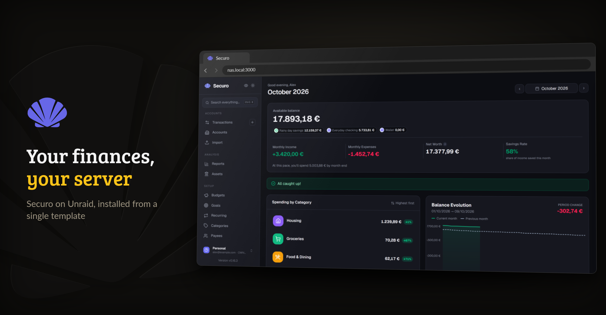
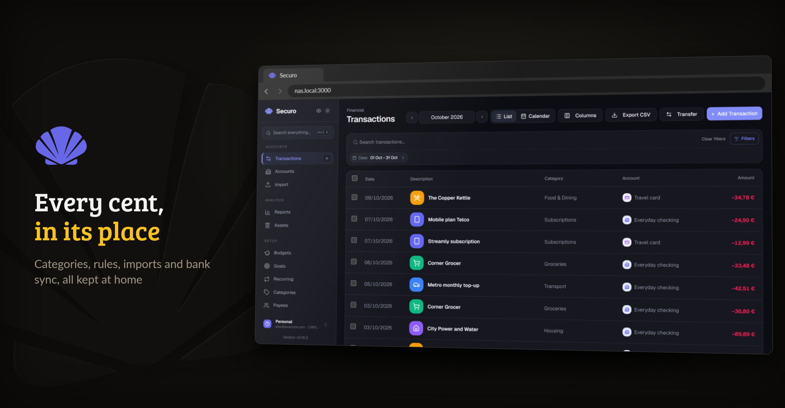

<p align="center">
  <picture>
    <source media="(prefers-color-scheme: dark)" srcset="https://raw.githubusercontent.com/junkerderprovinz/securo/main/.github/assets/banner-dark.png">
    
  </picture>
</p>

<p align="center">
  <a href="https://github.com/junkerderprovinz/securo/actions/workflows/build.yml"></a>&nbsp;
  <a href="https://github.com/junkerderprovinz/securo/actions/workflows/lint.yml"></a>&nbsp;
  <a href="https://hub.docker.com/r/junkerderprovinz/securo"></a>&nbsp;
  <a href="https://github.com/junkerderprovinz/securo/pkgs/container/securo"></a>&nbsp;
  <a href="https://github.com/securo-finance/securo"></a>&nbsp;
  <a href="https://unraid.net"></a>&nbsp;
  <a href="LICENSE"></a>
</p>

<br>

<p align="center">
The <b>Securo</b> personal finance manager on Unraid, from a single template. It uses the PostgreSQL
and Redis you already run, or brings its own when you have none.
</p>

<br>

<!-- download-buttons: written by scripts/gen_download_buttons.py -->
<p align="center">
  
  &nbsp;
  <a href="https://hub.docker.com/r/junkerderprovinz/securo/"></a>
  &nbsp;
  <a href="https://github.com/junkerderprovinz/securo/releases/latest"></a>
</p>
<!-- /download-buttons -->

<br>

<p align="center">
A one-knight job: I build it, keep it running, work through the issues and add what people ask for, until nothing is missing. It is free, with no accounts, no telemetry, no ads and no paid tier. No asterisk anywhere. Nothing readable ever leaves your own walls. Forged on evenings and weekends, with heart and stubbornness.
</p>

<p align="center">
If it has earned a place on your server or computer, toss a coin to your knight: it helps cover the costs and keeps the project alive. It also makes this knight's heart beat a little faster. Three ways below, whichever suits you.
</p>

<!-- give-buttons: written by scripts/gen_download_buttons.py -->
<p align="center">
  <a href="https://buymeacoffee.com/junkerderprovinz"></a>
  &nbsp;
  <a href="https://www.paypal.com/donate/?hosted_button_id=76FVV52TKXTUS"></a>
  &nbsp;
  <a href="https://junkerderprovinz.github.io/junkerderprovinz/"></a>
</p>
<!-- /give-buttons -->

<br>

## Table of Contents

1. [What it looks like](#1-what-it-looks-like)
2. [What it does](#2-what-it-does)
3. [Getting started](#3-getting-started)
4. [Bank sync and single sign-on](#4-bank-sync-and-single-sign-on)
5. [How AI is used here](#5-how-ai-is-used-here)
6. [Support this project](#6-support-this-project)

<br>

## 1. What it looks like

The accounts and amounts in these pictures are made up.

<p align="center">
  
  <br><em>The dashboard, served by the container on your server.</em>
</p>

<br>

<p align="center">
  
  <br><em>Transactions with categories, filters and a running balance.</em>
</p>

<br>

## 2. What it does

[Securo](https://github.com/securo-finance/securo) is a self-hosted finance manager: accounts, transactions, budgets, goals, assets and reports, with imports from OFX, QIF, CAMT and CSV and optional bank sync. Upstream ships it as six containers in a compose file. This image puts them into one, built from the official backend and frontend images:

- **Your own databases first.** By default Securo connects to the PostgreSQL and Redis containers you already have on Unraid. On the first start it creates its database and enables pgvector there.
- **Or everything built in.** Set **Built-in PostgreSQL** and **Built-in Redis** to `true`, and both run inside the container, listen only on `127.0.0.1` and keep their data in your appdata folder.
- **A secret key on the first start.** It is generated and kept in `secrets.env`, so nobody has to invent one.
- **One port.** nginx serves the web app and passes `/api/` to the backend. The Celery worker and scheduler run next to it, so bank syncs, recurring transactions and price updates work without extra containers.
- **A clear stop instead of a crash loop.** A missing database host, a wrong password or a PostgreSQL without pgvector ends in one line that says what to change.
- **Upstream unchanged.** The backend and the web app are the official images of the same version, and the settings from upstream's `.env.example` work as variables.

<br>

## 3. Getting started

1. Install **Securo** from Community Applications.
2. Pick your databases:
   - **PostgreSQL already running?** Enter its host, user and password. The server needs **pgvector**: `pgvector/pgvector:pg16` and the PostgreSQL image Immich uses both have it, the plain `postgres` image does not. If the user may create databases, Securo creates `securo` on the first start; otherwise create it yourself and run `CREATE EXTENSION vector;` in it as a superuser.
   - **Redis already running?** Enter its host, and its password if it has one. If other apps use database `0` on it, give Securo a number of its own under **Redis database**.
   - **Neither?** Set **Built-in PostgreSQL** and **Built-in Redis** to `true` and leave the host fields empty.
3. Set **App address** to the address you open Securo on, such as `http://192.168.1.10:3000` or `https://securo.example.com`. Bank sync and single sign-on send you back there.
4. Start the container. The first start creates the tables, which takes under a minute. It is ready when the log says `SECURO IS READY`.
5. Open the web app and create your account. To keep strangers from signing up, set **Registration** to `false` afterwards.

With `docker run`:

```bash
docker run -d --name securo \
  -p 3000:8080 \
  -v /mnt/user/appdata/securo:/data \
  -e FRONTEND_URL=http://192.168.1.10:3000 \
  -e BUILTIN_POSTGRES=true \
  -e BUILTIN_REDIS=true \
  junkerderprovinz/securo:latest
```

A few things worth knowing:

- **Passkeys need HTTPS on a domain.** Browsers refuse them on `http://192.168.1.10:3000`. Put Securo behind your reverse proxy with a certificate, or skip passkeys and use a password with two-factor codes.
- **Behind a reverse proxy,** set **Trusted proxies** to `2`, so the login rate limit counts each visitor on its own instead of all of them as your proxy.
- **Backups:** with the built-in database, stop the container and copy the appdata folder. With your own PostgreSQL, back up the `securo` database the way you back up the others.

<br>

## 4. Bank sync and single sign-on

All of this stays off until you fill in the fields. Each provider switches itself on once its credentials are present.

| Feature | What to set | Where you get it |
|---|---|---|
| European banks (PSD2) | **Enable Banking app ID**, and the private key as `enable_banking_private.pem` in the `secrets` folder of your appdata | Create a production application at [enablebanking.com](https://enablebanking.com). Its redirect URL is your **App address** followed by `/oauth/callback`, which needs https |
| US and other banks | **SimpleFIN** set to `true` | A setup token from the [SimpleFIN Bridge](https://bridge.simplefin.org/), pasted into Securo under Accounts |
| Brazilian banks | **Pluggy client ID** and **Pluggy client secret** | [dashboard.pluggy.ai](https://dashboard.pluggy.ai) |
| Single sign-on | **OIDC** set to `true`, plus discovery URL, client ID and secret | Your provider, such as Authentik or Pocket ID. The redirect URI is your **App address** followed by `/api/auth/oidc/callback` |

Every other setting from upstream's [`.env.example`](https://github.com/securo-finance/securo/blob/main/.env.example) works as a container variable with the same name. The optional AI agents are not part of this image yet.

<br>

## 5. How AI is used here

One knight builds this, and AI is one of the tools I work with, the same way I work with an editor or a compiler. It helps me write code and documentation and it checks my work, and that saves me a good many evenings. It does not make the decisions, though. I read and understand everything before it ships, and if something here breaks, that is on me and not on the tool.

You do not have to take my word for it. The code is open and every release note is written by hand. The issue tracker shows how problems actually get handled, including the ones I got wrong the first time. If you find something that is not right, open an issue and I will look at it.

<br>

## 6. Support this project

Questions, bugs, ideas or feature requests? Please [open a GitHub issue](https://github.com/junkerderprovinz/securo/issues). Problems with Securo itself, the app rather than the container, are best reported [upstream](https://github.com/securo-finance/securo/issues).

A one-knight job: I build it, keep it running, work through the issues and add what people ask for, until nothing is missing. It is free, with no accounts, no telemetry, no ads and no paid tier. No asterisk anywhere. Nothing readable ever leaves your own walls. Forged on evenings and weekends, with heart and stubbornness.

If it has earned a place on your server or computer, toss a coin to your knight: it helps cover the costs and keeps the project alive. It also makes this knight's heart beat a little faster. Three ways below, whichever suits you.

<!-- give-buttons: written by scripts/gen_download_buttons.py -->
<p align="center">
  <a href="https://buymeacoffee.com/junkerderprovinz"></a>
  &nbsp;
  <a href="https://www.paypal.com/donate/?hosted_button_id=76FVV52TKXTUS"></a>
  &nbsp;
  <a href="https://junkerderprovinz.github.io/junkerderprovinz/"></a>
</p>
<!-- /give-buttons -->

<br>

<sub>Securo is developed by the Securo project and released under AGPL-3.0. This is an independent packaging for Unraid and is not affiliated with the Securo project.</sub>
